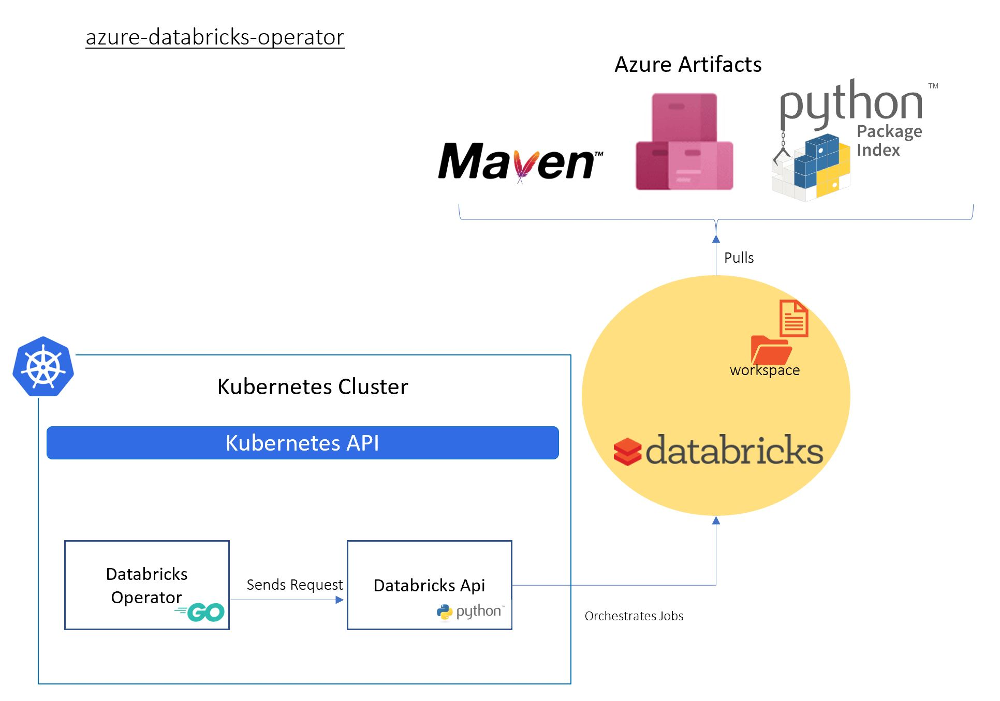
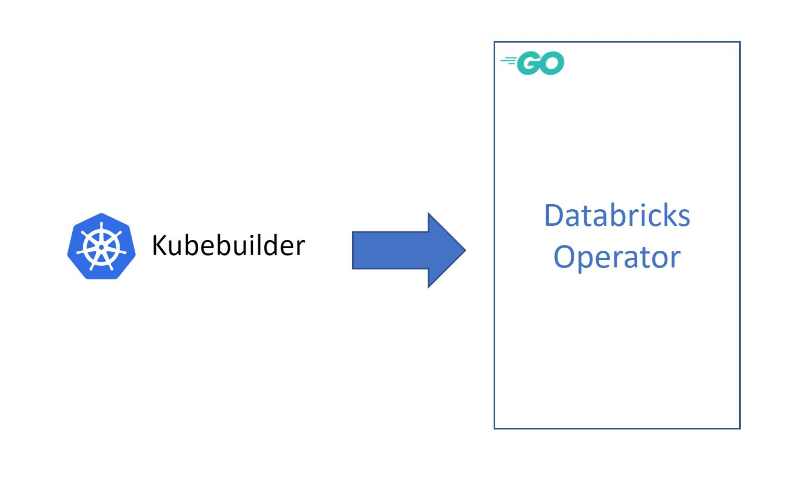

[](https://dev.azure.com/ms/azure-databricks-operator/_build/latest?definitionId=153&branchName=master)


[](https://dev.azure.com/ms/azure-databricks-operator/_build/latest?definitionId=152&branchName=master)


# Azure Databricks operator (for Kubernetes)

> This project is experimental. Expect the API to change. It is not recommended for production environments.

## Introduction

Kubernetes offers the facility of extending it's API through the concept of 'Operators' ([Introducing Operators: Putting Operational Knowledge into Software](https://coreos.com/blog/introducing-operators.html)). This repository contains the resources and code to deploy an Azure Databricks Operator for Kubernetes.

It is a Kubernetes controller that watches Customer Resource Definitions (CRDs) that define a Databricks job.



The Databricks operator is useful in situations where Kubernetes hosted applications wish to launch and use Databricks data engineering and machine learning tasks.

The project was built using

1. [Kubebuilder](https://book.kubebuilder.io/)
2. [ Golang SDK for Azure DataBricks REST API 2.0](https://github.com/xinsnake/databricks-sdk-golang)



### Prerequisites And Assumptions

1. You have the kubectl command line (kubectl CLI) installed.

2. You have acess to a Kubernetes cluster. It can be a local hosted Cluster like [Minikube](https://kubernetes.io/docs/tasks/tools/install-minikube/), [Kind](https://github.com/kubernetes-sigs/kind) or, Docker for desktop installed localy with RBAC enabled. if you opt for Azure Kubernetes Service ([AKS](https://azure.microsoft.com/en-au/services/kubernetes-service/)), you can use: `az aks get-credentials --resource-group $RG_NAME --name $Cluster_NAME`

* To configure a local Kubernetes cluster on your machine
    > You need to make sure a kubeconfig file is configured.

Basic commands to check your cluster

```shell
    kubectl config get-contexts
    kubectl cluster-info
    kubectl version
    kubectl get pods -n kube-system
```

## How to use the operator

*Documentation is a work in progress*

### Quick start

1. Download [latest release.zip](https://github.com/microsoft/azure-databricks-operator/releases)

```sh
wget https://github.com/microsoft/azure-databricks-operator/releases/latest/download/release.zip
unzip release.zip
```

2. Create the `databricks-operator-system` namespace

```sh
kubectl create namespace databricks-operator-system
```

3. [Generate a databricks token](https://docs.databricks.com/api/latest/authentication.html#generate-a-token), and create Kubernetes secrets with values for `DATABRICKS_HOST` and `DATABRICKS_TOKEN`

```shell
    kubectl  --namespace databricks-operator-system create secret generic dbrickssettings --from-literal=DatabricksHost="https://xxxx.azuredatabricks.net" --from-literal=DatabricksToken="xxxxx"
```

4. Apply the manifests for the CRD and Operator in `release/config`:

```sh
kubectl apply -f release/config
```

5. Create a test secret, you can pass the value of Kubernetes secrets into your notebook as Databricks secrets

```sh
kubectl create secret generic test --from-literal=my_secret_key="my_secret_value"
```

6. In Databricks, [create a new Python Notebook](https://docs.databricks.com/user-guide/notebooks/notebook-manage.html#create-a-notebook) called `testnotebook` in the root of your [Workspace](https://docs.databricks.com/user-guide/workspace.html#folders). Put the following in the first cell of the notebook:

```py
run_name = dbutils.widgets.get("run_name")
secret_scope = run_name + "_scope"

secret_value = dbutils.secrets.get(scope=secret_scope, key="dbricks_secret_key") # this will come from a kubernetes secret
print(secret_value) # will be redacted

value = dbutils.widgets.get("flag")
print(value) # 'true'
```

7. Define your Notebook job and apply it

```yaml
apiVersion: microsoft.k8s.io/v1beta1
kind: NotebookJob
metadata:
  annotations:
    microsoft.k8s.io/author: azkhojan@microsoft.com
  name: samplejob1
spec:
  notebookTask:
    notebookPath: "/testnotebook"
  timeoutSeconds: 500
  notebookSpec:
    "flag":  "true"
  notebookSpecSecrets:
  - secretName: "test"
    mapping:
    - "secretKey": "my_secret_key"
      "outputKey": "dbricks_secret_key"
  notebookAdditionalLibraries:
    - type: "maven"
      properties:
        coordinates: "com.microsoft.azure:azure-eventhubs-spark_2.11:2.3.9" # installs the azure event hubs library
  clusterSpec:
    sparkVersion: "5.2.x-scala2.11"
    nodeTypeId: "Standard_DS12_v2"
    numWorkers: 1
```

8. Check the NotebookJob and Operator pod

```sh
# list all notebook jobs
kubectl get notebookjob
# describe a notebook job
kubectl describe notebookjob samplejob1
# describe the operator pod
kubectl -n databricks-operator-system describe pod databricks-operator-controller-manager-0
# get logs from the manager container
kubectl -n databricks-operator-system logs databricks-operator-controller-manager-0 -c dbricks
```

9. Check the job ran with expected output in the Databricks UI.

### Run Souce Code

1. Clone the repo  - make sure your go path points to `microsoft\azure-databricks-operator`

2. Install the NotebookJob CRD in the configured Kubernetes cluster folder ~/.kube/config,
run `kubectl apply -f databricks-operator/config/crds` or `make install -C databricks-operator`

3. Create secrets for `DATABRICKS_HOST` and `DATABRICKS_TOKEN`

    ```shell
    kubectl  --namespace databricks-operator-system create secret generic dbrickssettings --from-literal=DatabricksHost="https://xxxx.azuredatabricks.net" --from-literal=DatabricksToken="xxxxx"
    ```

    Make sure your secret name is set correctly in `databricks-operator/config/default/azure_databricks_api_image_patch.yaml`

4. Deploy the controller in the configured Kubernetes cluster folder ~/.kube/config, run `kustomize build databricks-operator/config | kubectl apply -f -`

5. Change the NotebookJob name from `sample1run1` to your desired name, set the Databricks notebook path and update the values in `microsoft_v1beta2_notebookjob.yaml` to reflect your Databricks environment

    ```shell
    kubectl apply -f databricks-operator/config/samples/microsoft_v1beta2_notebookjob.yaml
    ```

### How to extend the operator and build your own images

#### Updating the Databricks operator:

This Repo is generated by [Kubebuilder](https://book.kubebuilder.io/) `legacy version`.

To Extend the operator `databricks-operator`:

1. Run `go mod tidy` to download dependencies. It doesn't show any progress bar and takes a while to download all of dependencies.
2. Update `pkg\apis\microsoft\v1beta1\notebookjob_types.go`.
3. Regenerate CRD `make manifests`.
4. Install updated CRD `make install`
5. Generate code `make generate`
6. Update operator `pkg\controller\notebookjob\notebookjob_controller.go`
7. Update tests and run `make test`
8. Build `make build`
9. Deploy

    ```shell
    make docker-build IMG={your-docker-image-name}
    make docker-push IMG={your-docker-image-name}
    make deploy
    ```
## Main Contributors

1. Jordan Knight [Github](https://github.com/jakkaj), [Linkedin](https://www.linkedin.com/in/jakkaj/)
2. Paul Bouwer [Github](https://github.com/paulbouwer), [Linkedin](https://www.linkedin.com/in/pbouwer/)
3. Lace Lofranco [Github](https://github.com/devlace), [Linkedin](https://www.linkedin.com/in/lacelofranco/)
4. Allan Targino [Github](https://github.com/allantargino), [Linkedin](https://www.linkedin.com/in/allan-targino//)
5. Rian Finnegan[Github](https://github.com/xtellurian), [Linkedin](https://www.linkedin.com/in/rian-finnegan-97651b55/)
6. Xinyun Jacob Zhou[Github](https://github.com/xinsnake),[Linkedin](https://www.linkedin.com/in/xinyun-zhou/)
7. Jason Goodsell [Github](https://github.com/JasonTheDeveloper), [Linkedin](https://www.linkedin.com/in/jason-goodsell-2505a3b2/)
8. Craig Rodger [Github](https://github.com/crrodger), [Linkedin](https://www.linkedin.com/in/craigrodger/)
9. Justin Chizer [Github](https://github.com/justinchizer), [Linkedin](https://www.linkedin.com/in/jchizer/)
10. Azadeh Khojandi [Github](https://github.com/Azadehkhojandi), [Linkedin](https://www.linkedin.com/in/azadeh-khojandi-ba441b3/)

## Resources

#### Kubernetes on WSL

On windows command line run `kubectl config view` to find the values of [windows-user-name],[minikubeip],[port]

```shell
mkdir ~/.kube \
&& cp /mnt/c/Users/[windows-user-name]/.kube/config ~/.kube

kubectl config set-cluster minikube --server=https://<minikubeip>:<port> --certificate-authority=/mnt/c/Users/<windows-user-name>/.minikube/ca.crt
kubectl config set-credentials minikube --client-certificate=/mnt/c/Users/<windows-user-name>/.minikube/client.crt --client-key=/mnt/c/Users/<windows-user-name>/.minikube/client.key
kubectl config set-context minikube --cluster=minikube --user=minikub

```

More info:

1. https://devkimchi.com/2018/06/05/running-kubernetes-on-wsl/
2. https://www.jamessturtevant.com/posts/Running-Kubernetes-Minikube-on-Windows-10-with-WSL/

### Build pipelines
1. [Create a pipeline and add a status badge to Github](https://docs.microsoft.com/en-us/azure/devops/pipelines/create-first-pipeline?view=azure-devops&tabs=tfs-2018-2)
2. [Customize status badge with shields.io](https://shields.io/)


## Contributing

This project welcomes contributions and suggestions.  Most contributions require you to agree to a
Contributor License Agreement (CLA) declaring that you have the right to, and actually do, grant us
the rights to use your contribution. For details, visit https://cla.microsoft.com.

When you submit a pull request, a CLA-bot will automatically determine whether you need to provide
a CLA and decorate the PR appropriately (e.g., label, comment). Simply follow the instructions
provided by the bot. You will only need to do this once across all repos using our CLA.

This project has adopted the [Microsoft Open Source Code of Conduct](https://opensource.microsoft.com/codeofconduct/).
For more information see the [Code of Conduct FAQ](https://opensource.microsoft.com/codeofconduct/faq/) or
contact [opencode@microsoft.com](mailto:opencode@microsoft.com) with any additional questions or comments.
