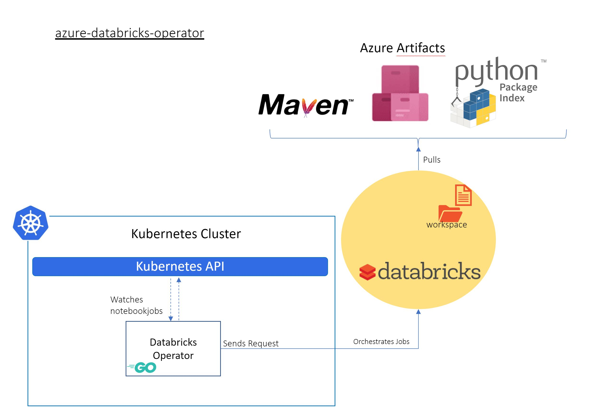

# Azure Databricks operator (for Kubernetes)
[](https://dev.azure.com/ms/azure-databricks-operator/_build/latest?definitionId=254&branchName=master)
[](https://goreportcard.com/report/github.com/microsoft/azure-databricks-operator)
[](https://github.com/microsoft/azure-databricks-operator/blob/master/LICENSE)
> This project is experimental. Expect the API to change. It is not recommended for production environments.


## Introduction

Kubernetes offers the facility of extending its API through the concept of [Operators](https://kubernetes.io/docs/concepts/extend-kubernetes/operator/). This repository contains the resources and code to deploy an Azure Databricks Operator for Kubernetes.

The Databricks operator is useful in situations where Kubernetes hosted applications wish to launch and use Databricks data engineering and machine learning tasks.

### Key benefits of using Azure Databricks operator

1. Easy to use: Azure Databricks operations can be done by using Kubectl there is no need to learn or install data bricks utils command line and it’s python dependency

2. Security: No need to distribute and use Databricks token, the data bricks token is used by operator 

3. Version control: All the YAML or helm charts which has azure data bricks operations (clusters, jobs, …) can be tracked 

4. Automation: Replicate azure data bricks operations on any data bricks workspace by applying same manifests or helm charts 





The project was built using

1. [Kubebuilder](https://book.kubebuilder.io/)
2. [Golang SDK for DataBricks](https://github.com/polar-rams/databricks-sdk-golang)

## How to use Azure Databricks operator

1. Download [the latest release manifests](https://github.com/microsoft/azure-databricks-operator/releases):

```sh
wget https://github.com/microsoft/azure-databricks-operator/releases/latest/download/release.zip
unzip release.zip
```

2. Create the `azure-databricks-operator-system` namespace:

```sh
kubectl create namespace azure-databricks-operator-system
```

3. Create Kubernetes secrets with values for `DATABRICKS_HOST` and `DATABRICKS_TOKEN`:

```shell
kubectl --namespace azure-databricks-operator-system \
    create secret generic dbrickssettings \
    --from-literal=DatabricksHost="https://xxxx.azuredatabricks.net" \
    --from-literal=DatabricksToken="xxxxx"
```

4. Apply the manifests for the Operator and CRDs in `release/config`:

```sh
kubectl apply -f release/config
```


For details deployment guides please see [deploy.md](https://github.com/microsoft/azure-databricks-operator/blob/master/docs/deploy.md)

## Samples 

1. Create a spark cluster on demand and run a databricks notebook.


2. Create an interactive spark cluster and Run a databricks job on exisiting cluster.


3. Create azure databricks secret scope by using kuberentese secrets


For samples and simple use cases on how to use the operator please see [samples.md](docs/samples.md)

## Quick start

On click start by using [vscode](https://code.visualstudio.com/)


For more details please see
[contributing.md](https://github.com/microsoft/azure-databricks-operator/blob/master/docs/contributing.md)

## Roadmap

Check [roadmap.md](https://github.com/microsoft/azure-databricks-operator/blob/master/docs/roadmap.md) for what has been supported and what's coming.

## Resources

Few topics are discussed in the [resources.md](https://github.com/microsoft/azure-databricks-operator/blob/master/docs/resources.md)

- Dev container
- Build pipelines
- Operator metrics
- Kubernetes on WSL

## Contributing

For instructions about setting up your environment to develop and extend the operator, please see
[contributing.md](https://github.com/microsoft/azure-databricks-operator/blob/master/docs/contributing.md)

This project welcomes contributions and suggestions.  Most contributions require you to agree to a
Contributor License Agreement (CLA) declaring that you have the right to, and actually do, grant us
the rights to use your contribution. For details, visit https://cla.microsoft.com.

When you submit a pull request, a CLA-bot will automatically determine whether you need to provide
a CLA and decorate the PR appropriately (e.g., label, comment). Simply follow the instructions
provided by the bot. You will only need to do this once across all repos using our CLA.

This project has adopted the [Microsoft Open Source Code of Conduct](https://opensource.microsoft.com/codeofconduct/).
For more information see the [Code of Conduct FAQ](https://opensource.microsoft.com/codeofconduct/faq/) or
contact [opencode@microsoft.com](mailto:opencode@microsoft.com) with any additional questions or comments.
