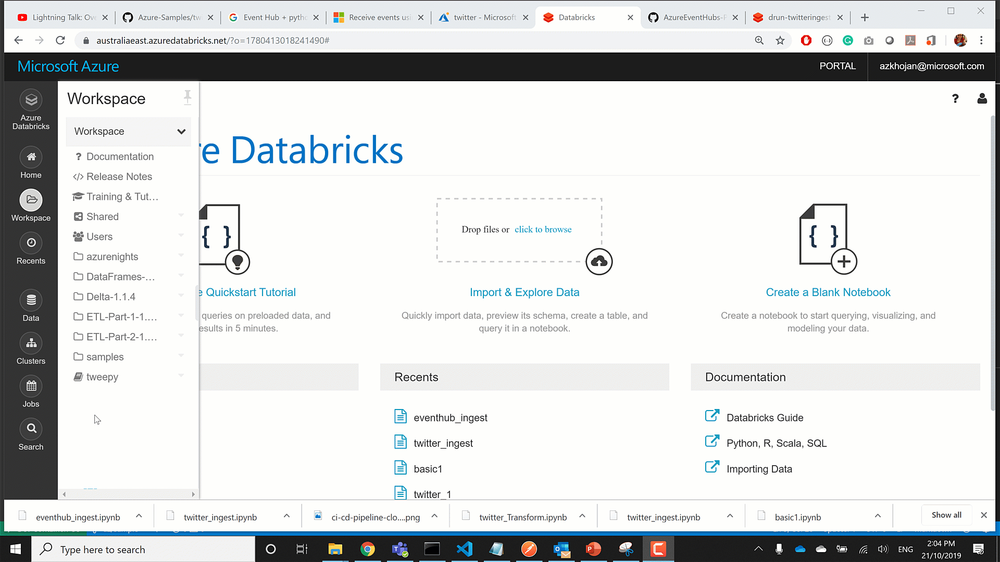
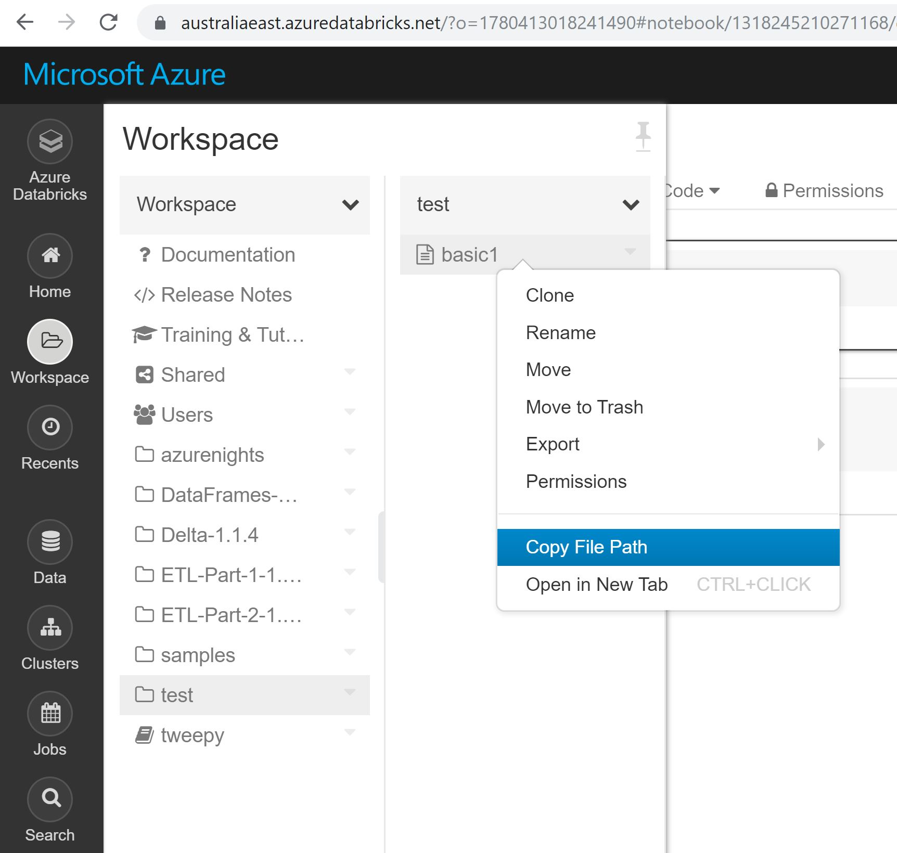
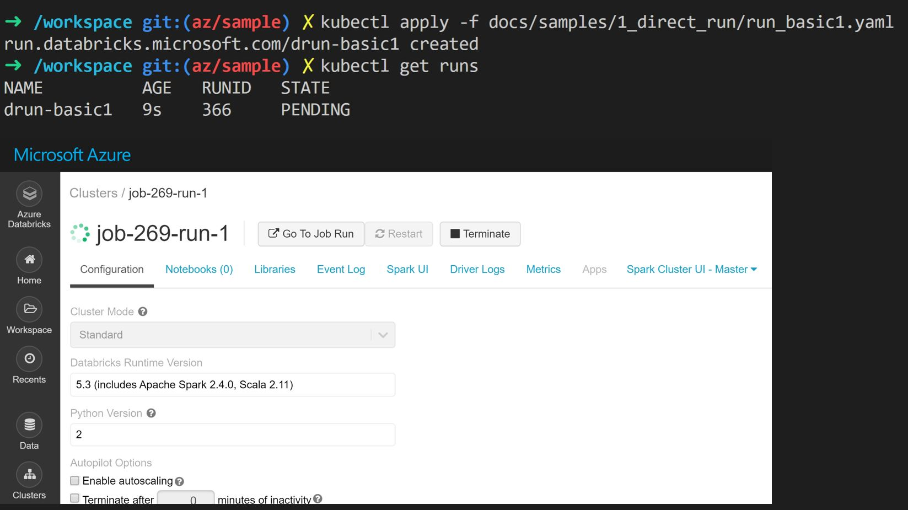
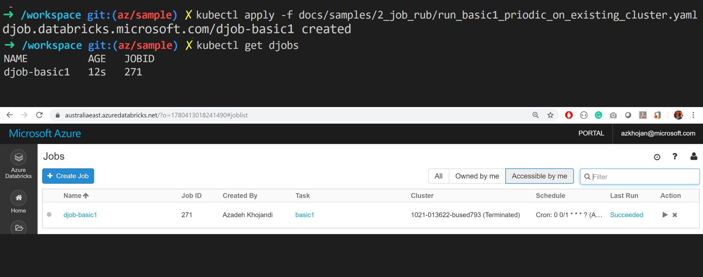

# Direct Run

## 1. Create a spark cluster and Run databricks notebook

[Direct run sample](samples/1_direct_run) shows how you can a spark cluster and run a databricks notebook.

1. Upload [basic1.ipynb](samples/1_direct_run/basic1.ipynb) 




2. Update `notebook_path` in `samples/1_direct_run/run_basic1.yaml` file



3. Apply `samples/1_direct_run/run_basic1.yaml`



## 2. Create an interactive spark cluster and Run a databricks job on that cluster 


[Databricks periodic job sample](samples/2_job_run) shows how you can create an interactive spark cluster in databricks and attach it to one or many databricks notebooks.

1. Apply `samples/2_job_run/cluster_interactive1.yaml` file

2. Update `existing_cluster_id` in `samples/2_job_run/run_basic1_periodic_on_existing_cluster.yaml` file 

3. Apply `samples/2_job_run/run_basic1_periodic_on_existing_cluster.yaml`



## 3. Create Secret scopes, installing dependencies/libraries on spark cluster 

[Databricks twitter ingest sample](samples/3_secret_scope) shows how you can create secret scopes in databricks, install libraries on your cluster, run a job that ingests data and acts as a message producer and sends the message to eventhub. 

1. Upload [eventhub_ingest.ipynb](samples/3_secret_scope/eventhub_ingest.ipynb) 
2. Upload [twitter_ingest.ipynb](samples/3_secret_scope/twitter_ingest.ipynb)
3. [Create eventhub namespace and eventhub in azure](https://docs.microsoft.com/en-us/azure/event-hubs/event-hubs-create) 
4. Setup your twitter deveopler account
5. Replace `xxxxx` with correct values and create these two secrets

```
kubectl create secret generic twitter-secret --from-literal=TwitterAPIkey=xxxxx --from-literal=TwitterAPISecret=xxxxx --from-literal=TwitterAccessToken=xxxxx --from-literal=TwitterAccessSecret=xxxxx
```

```
kubectl create secret generic eventhubnamespace-secret --from-literal=EventhubNamespace=xxxxx --from-literal=SharedAccessKeyName=xxxxx --from-literal=SharedAccessKey=xxxxx  --from-literal=ConnectionString=Endpoint=sb://xxxxx.servicebus.windows.net/;SharedAccessKeyName=xxxxx;SharedAccessKey=xxxxx
```

6. Apply `samples/3_secret_scope/secretscope_twitter.yaml`
7. Apply `samples/3_secret_scope/secretscope_eventhub.yaml`
8. Apply `samples/2_job_run/cluster_interactive1.yaml` file if you haven't already
2. Update `existing_cluster_id` in `samples/3_secret_scope/run_twitter1.yaml` file 
8. Apply `samples/3_secret_scope/run_twitter1.yaml`
